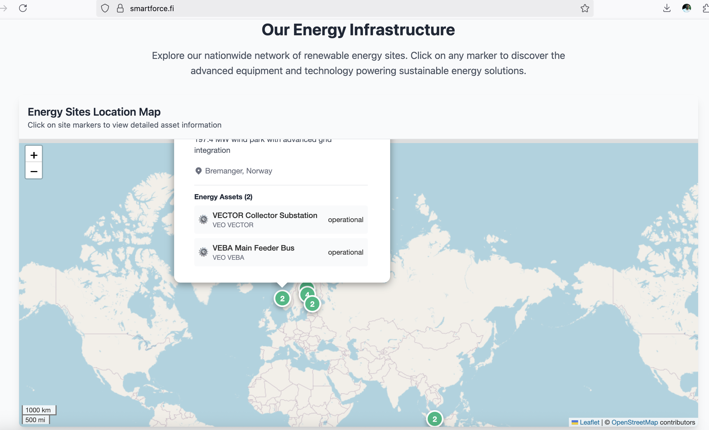
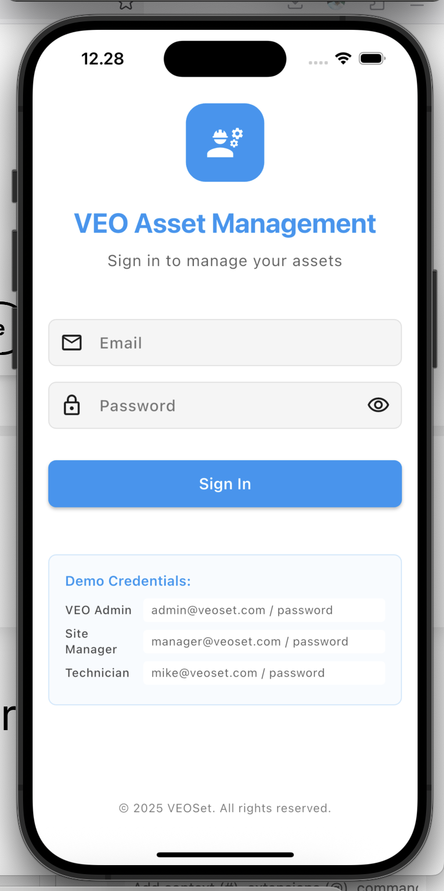
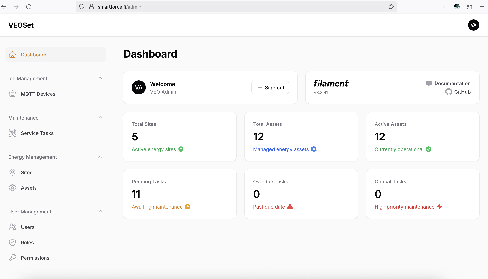
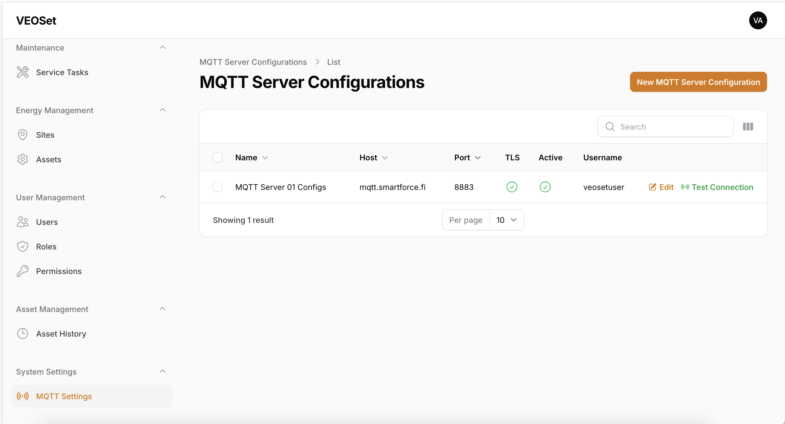

# VEOset - Energy Asset Management System

A comprehensive Laravel 12 Filament 3 backend with API, API documentation & Flutter mobile app for energy business asset information and service tasks management.

## 🎯 Project Overview

VEOset is designed for daily energy business operations, providing real-time information for customers, VEO LCS, and service companies. The system enables maintenance personnel to access prevention maintenance schedules and manage asset lifecycle efficiently.

### Key Features

- **Asset Information Management** - Track and manage energy assets across multiple sites
- **Service Task Management** - Schedule and monitor maintenance activities
- **Real-time Data Access** - Live information for all stakeholders
- **Prevention Maintenance Scheduling** - Proactive maintenance planning
- **Multi-platform Support** - iOS, Android apps and web interface
- **Role-based Access** - Secure access for different user types

## 🏗️ System Architecture

### Data Flow
```
Main Control Panel (VEO) → Multiple Sites → Multiple Assets per Site
```

### Data Structure
- **Sites & Locations** - Geographic and operational organization
- **Assets** - Physical equipment and infrastructure
- **Asset Metadata** - Maintenance-specific information
- **Service Tasks** - Scheduled and on-demand maintenance activities

### Core Entities
- **Site**: Container for multiple assets
- **Asset**: Name, Date, Mode, Metadata
- **Asset Metadata**: Maintenance schedules, lifecycle data
- **Service Tasks**: Maintenance activities and schedules

## 🚀 Solution Components

### Priority Features
- ✅ **Mobile Apps** (iOS and Android) - Asset information and service tasks
- 🎁 **Web Interface** - Same functionalities with responsive design

### Business Focus
- **Real-time Information** - Live data for customers, VEO LCS, and service companies
- **Sustainability** - Lifecycle support and maintenance optimization
- **Security** - Secure system and asset management
- **MAAS** - Maintenance As A Service implementation

## 🎨 Design Principles

### Core Values
- **Simplicity** - Clean, intuitive interfaces
- **User Friendly** - Logical steps and guided user experience
- **Innovation** - Modern technical implementation with cloud-first approach

### Technical Focus
- ☁️ **Cloud-based Database** - AWS/Azure integration
- 📱 **Cross-platform Apps** - Native mobile and responsive web
- 🔐 **Secure Access** - Role-based permissions and data protection
- 🎯 **Guided UI** - Step-by-step user workflows

## 🛠️ Technology Stack

### Backend
- **Laravel 12** - Modern PHP framework
- **Filament 3** - Admin panel and resource management
- **Laravel Sanctum** - API authentication
- **Spatie Permissions** - Role-based access control
- **SQLite/MySQL** - Database layer

### API & Documentation
- **RESTful API** - Mobile app integration
- **OpenAPI/Swagger** - Comprehensive API documentation
- **Real-time Updates** - WebSocket support for live data

### Frontend
- **Flutter** - Cross-platform mobile development
- **Responsive Web** - Filament-powered web interface
- **Modern UI/UX** - Material Design principles

### Cloud Infrastructure
- **AWS/Azure** - Cloud database and hosting
- **CDN** - Global content delivery
- **Monitoring** - Application performance tracking

### Screens

#### Dashboard Overview


#### Asset Management


#### Mobile App Screens
<div style="display: flex; gap: 10px;">
    (https://smartforce.fi/images/front-end.png)
    (https://smartforce.fi/images/mobile-ios.png)
    (https://smartforce.fi/images/mobile-android.png)
    (https://smartforce.fi/images/bckend-admin01.png)
    (https://smartforce.fi/images/bckend-admin02.png)
    (https://smartforce.fi/images/bckend-admin10.png)

</div>

#### System Architecture


## 🚀 Getting Started

### Prerequisites
- PHP 8.2+
- Composer
- Node.js & NPM
- Flutter SDK (for mobile development)

### Installation

1. **Clone and Install Dependencies**
   ```bash
   git clone <repository-url> veoset
   cd veoset
   composer install
   npm install
   ```

2. **Environment Setup**
   ```bash
   cp .env.example .env
   php artisan key:generate
   ```

3. **Database Setup**
   ```bash
   php artisan migrate --seed
   ```

4. **Filament Admin Setup**
   ```bash
   php artisan make:filament-user
   ```

5. **Start Development Server**
   ```bash
   composer run dev
   ```

### API Documentation
Access the API documentation at: `http://localhost:8000/api/documentation`

### Admin Panel
Access the Filament admin panel at: `http://localhost:8000/admin`

## 📱 Mobile App Development

### Flutter Setup
```bash
cd mobile_app
flutter pub get
flutter run
```

### API Integration
The Flutter app connects to the Laravel API for:
- Authentication and authorization
- Real-time asset data
- Maintenance task management
- Offline capability with sync

## 🔧 Development Guide

### Database Models
- **Site Model** - Manages location and organizational data
- **Asset Model** - Core asset information and relationships
- **AssetMetadata Model** - Maintenance-specific data
- **ServiceTask Model** - Maintenance activities and scheduling
- **User Model** - Authentication and role management

### API Endpoints
- `GET /api/sites` - List all sites
- `GET /api/sites/{id}/assets` - Site-specific assets
- `GET /api/assets/{id}` - Asset details and metadata
- `POST /api/service-tasks` - Create maintenance tasks
- `PUT /api/service-tasks/{id}` - Update task status

### Filament Resources
- **SiteResource** - Site management interface
- **AssetResource** - Asset CRUD operations
- **ServiceTaskResource** - Maintenance task management
- **UserResource** - User and role management

## 🔒 Security & Authentication

### User Roles
- **VEO Admin** - Full system access
- **Site Manager** - Site-specific management
- **Maintenance Staff** - Task execution and reporting
- **Customer** - Read-only asset information

### API Security
- JWT token authentication
- Role-based API access
- Rate limiting and throttling
- Input validation and sanitization

## 📊 Maintenance & Monitoring

### Prevention Maintenance
- **Scheduled Tasks** - Automated maintenance planning
- **Lifecycle Tracking** - Asset sustainability monitoring
- **Performance Metrics** - KPI dashboard and reporting
- **Alert System** - Proactive maintenance notifications

### System Monitoring
- **Application Performance** - Response time and uptime tracking
- **Database Performance** - Query optimization and monitoring
- **API Usage** - Endpoint analytics and usage patterns
- **Error Tracking** - Comprehensive logging and alerting

## 🌐 Cloud Deployment

### AWS Deployment
- **EC2/ECS** - Application hosting
- **RDS** - Managed database
- **S3** - File storage and backups
- **CloudFront** - CDN for global access

### Azure Deployment
- **App Service** - Web application hosting
- **Azure Database** - Managed database service
- **Blob Storage** - File and asset storage
- **Application Insights** - Monitoring and analytics

## 🤝 VEO Integration

### VEO360 Connection
- Integration with existing VEO360 platform
- Asset scanning and data synchronization
- Customer portal connectivity
- Legacy system compatibility

### Demo Features
Visit VEO booth to explore:
- **VEO360 Demos** - Live system demonstration
- **Customer Portal** - End-user experience
- **Scanned Assets** - Real asset data examples
- **Technical Discussion** - Implementation guidance

## 📖 Documentation

### Technical Documentation
- [API Documentation](./docs/api.md)
- [Database Schema](./docs/database.md)
- [Deployment Guide](./docs/deployment.md)
- [Mobile App Guide](./docs/mobile.md)

### User Guides
- [Admin Panel Guide](./docs/admin-guide.md)
- [Mobile App User Guide](./docs/mobile-guide.md)
- [Maintenance Workflows](./docs/maintenance-guide.md)

## 🤝 Contributing

Please read our [Contributing Guidelines](CONTRIBUTING.md) for details on our code of conduct and the process for submitting pull requests.

## 📄 License

This project is licensed under the MIT License - see the [LICENSE](LICENSE) file for details.

## 🆘 Support

For technical support and questions:
- Check VEO booth for mentorship
- Review VEO360 and Customer Portal demos
- Contact development team for technical implementation guidance

---

**Built with ❤️ for the Energy Industry - Focusing on Sustainability, Security, and User Experience**
